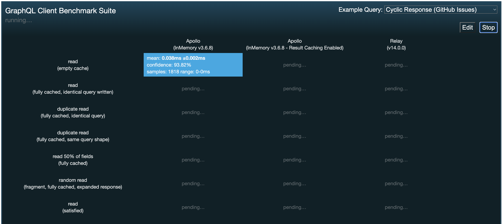

# GraphQL client cache benchmark
## Intro
A tool to benchmark the cache performance of various GraphQL clients in reading/writing/updating data in the cache. It uses the core API's of the GraphQL clients to meassure to achieve front-end framework agnostic results.

## Experiment setup
This section is to outline the conditions under which the benchmark was ran and achieved the results depicted below.
- **OS**: macOS Monterey 12.5
- **CPU**: 2.4 GHz 8-Core Intel Core i9
- **GPU**: Intel UHD Graphics 630 1536 MB
- **RAM**: 32 GB 2667 MHz DDR4
- **Browser**: Google Chrome  - Version 103.0.5060.134 (Official Build) (x86_64)
## Goals
The goal of this tool is to provide reliable and holistic data about cache performance that can drive key decisions while choosing a GraphQL client. It should provide a big enough variety of examples to be able to tailor decesions based on individual factors and use cases.

## Current state
 
Currently this tool has been upgraded to use the newest versions of GraphQL clients. Bellow is a description about the clients used by the tool and example queries tested.
### Clients
At the moment, this benchmark is set up to work with two GraphQL clients - Apollo Client 3.8, Relay 14.0. These are one of the most popular GraphQL clients, however, the benchmark is not only limited to them. New clients can be added without bigger effort. 

Furthemore, Apollo client can be seen twice in the benchmark and that is because we are testing it with and without the Result cache enabled. Result cache is one of the two parts of Apollo clients' cache which is used to memoize query responses and then provides more than 10x faster response times when the exact same query is read in the future. However, this is a niche use case and therefore, we have decided to look at the difference in performance in all the use cases.

### Examples
The tool uses various query examples to run the benchmark. It has two built in queries for the users to try out, however, the main concept is that users can add their own queries from their real-life use cases easily and run the benchmark on them. This allows everyone to test exactly what their application will be doing the most and therefore make better informed decisions.

## Findings
 
From the results of the benchmark we have found that generally throught different examples and tests the Relay client has been performing 10x faster throught the board. This raises questions about what are they doing better and what is stopping people from making Relay their first choice. One of the factors in decision making is definitelly ease of use, as Relay has a steeper learning curve compared to Apollo or others.

## Future
### Reliability check
This benchmark is to be checked by the authors of the above mentioned GraphQL clients to make sure that the usage of the clients' core API's is correct and that neither of the clients is favoured.

### Memory
In light of the previously mentioned findings we have decided that a memory meassurement would be a welcome addition to benchmark as Relay might be using more memory to support its fast response times.

## Related work
[Original benchmark tool](https://github.com/convoyinc/graphql-client-benchmarks)
